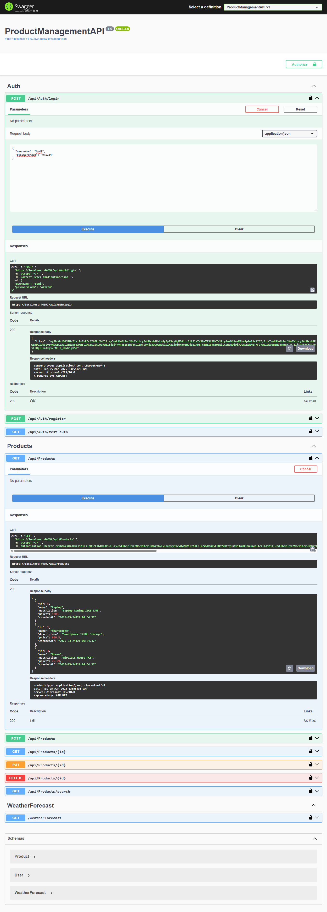

# Product Management API

## Prerequisites
- .NET 8.0 SDK
- SQL Server 2014
- Visual Studio 2022

## Setup
1. Clone repository ini.
2. Buka solusi di Visual Studio 2022.
3. Atur connection string di `appsettings.json`.
4. Jalankan migrasi database:
   ```bash
   dotnet ef database update

